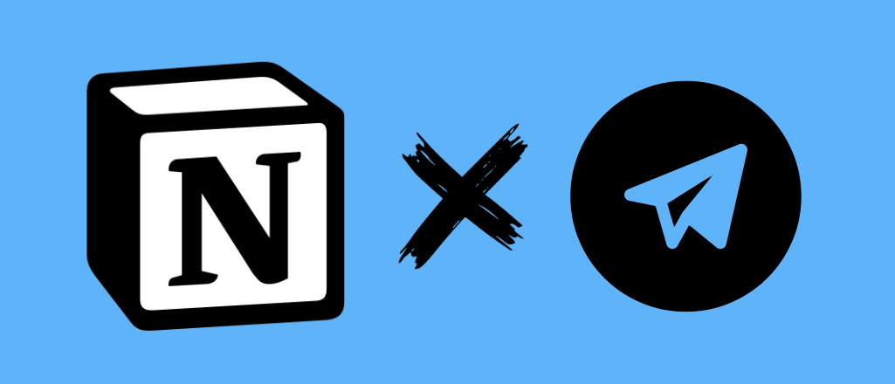

# Telegram Notion Bot

<p style="text-align:center;">
    
</p>

## Introduction

Telegram bot that enables users to access and update `Notion Workspace` items like `Pages`, `Databases` and `Blocks` from within Telegram. Bot can be found ***@tele_notion_bot*** 🚀.

## Bot Usage Snippets

***Note: This project is still a work in progress as such functionality may (will) change. Also, Bot is still in development and testing locally.***

### Start and Authenticate with Notion Workspace

```sh
/start > Authenticate Notion 🔑
```

### Searching for Pages & Databases

```sh
/search > Get Pages 📝
/search > Get Databases 💾
```
